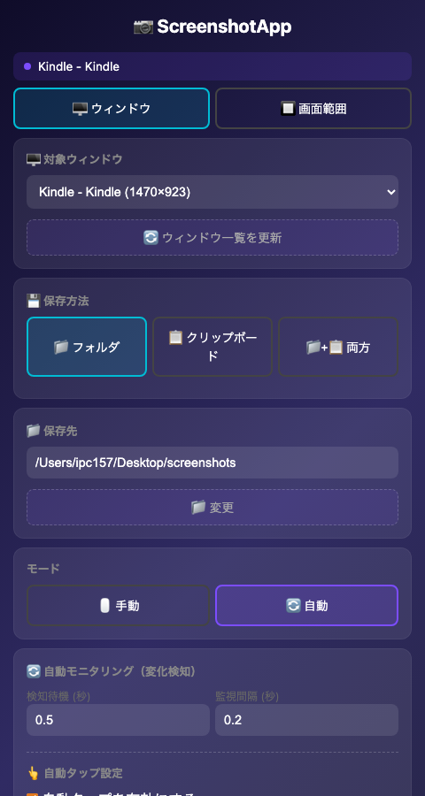
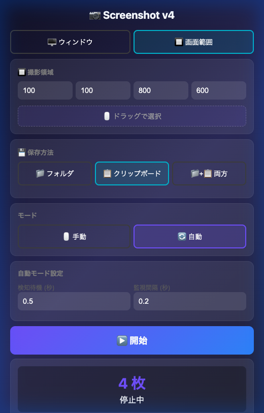
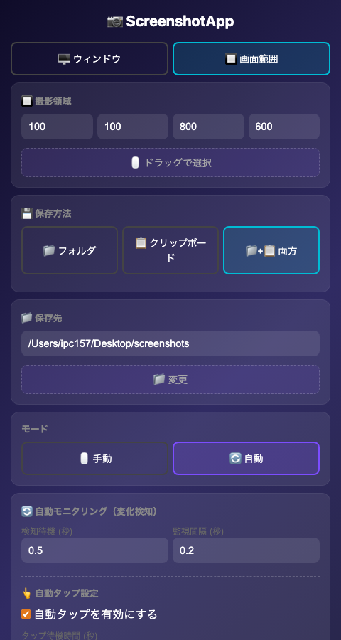
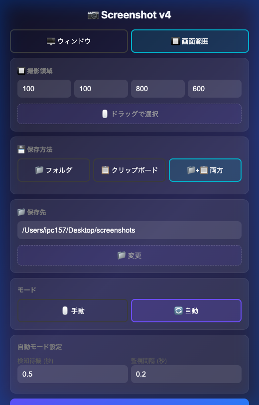

# 📷 ScreenshotApp — 使い方ガイド

macOS 用のウィンドウ指定・領域指定スクリーンショットアプリです。  
特定のウィンドウや画面範囲を指定して、**最前面でなくても**キャプチャできます。さらに、画面の自動タップ機能も搭載しています。

> [!IMPORTANT]
> 初めて使う方は、**Step 1 → Step 2 → Step 3** の順に進めてください。

---

## Step 1: macOS の設定を変更する

アプリを使うには、以下の macOS 権限を**事前に許可**する必要があります。

### 設定手順

1. **画面収録** の許可
   - `システム設定` → `プライバシーとセキュリティ` → `画面収録`
   - `ターミナル` を **ON** にする

2. **アクセシビリティ** の許可
   - `システム設定` → `プライバシーとセキュリティ` → `アクセシビリティ`
   - `ターミナル` を **ON** にする

> [!CAUTION]
> この設定を行わないと、スクリーンショットが正しく撮れなかったり、ショートカットや自動タップが動作しません。  
> 設定変更後、Macの**再起動が必要な場合**があります。

---

## Step 2: 初回セットアップを実行する

`【初回にまずは実行してください】setup.command` を**ダブルクリック**してください。

ターミナルが自動的に開き、以下が実行されます：

1. ✅ Python 仮想環境（venv）の作成
2. ✅ 必要なパッケージのインストール
3. ✅ `ScreenshotApp.app` の生成

完了すると「✅ セットアップ完了！」と表示されます。Enter を押してターミナルを閉じてください。

> [!IMPORTANT]
> 「開発元が未確認」と表示された場合は、ファイルを**右クリック → 開く** で実行してください。

---

## Step 3: アプリを起動する

`ScreenshotApp.app` を**ダブルクリック**して起動します。

ブラウザが自動的に開き、操作画面が表示されます。

> [!TIP]
> `ScreenshotApp.app` を Dock にドラッグ＆ドロップすると、次回からすぐ起動できます。

---

## 操作画面の説明



画面は上から順に以下のセクションで構成されています：

| セクション                    | 説明                                       |
| ----------------------------- | ------------------------------------------ |
| **キャプチャ対象**            | 🖥 ウィンドウ / 🔲 画面範囲 の切り替え     |
| **対象ウィンドウ / 撮影領域** | キャプチャ対象の詳細設定                   |
| **💾 保存方法**               | フォルダ / クリップボード / 両方 の3モード |
| **📁 保存先**                 | スクリーンショットの保存フォルダ           |
| **モード**                    | 🖱 手動 / 🔄 自動 の撮影モード             |
| **自動モード設定**            | 変化検知設定 / **👆自動タップ設定**        |
| **▶ 開始 / ⏹ 停止**           | キャプチャの開始・停止ボタン               |
| **撮影枚数**                  | 現在のキャプチャ枚数とステータス           |

---

## キャプチャ対象の選択

### 🖥 ウィンドウモード

特定のアプリケーションウィンドウをキャプチャします。**ウィンドウが最前面でなくてもキャプチャ可能**です。

1. 「🖥 ウィンドウ」ボタンを選択
2. ドロップダウンからキャプチャしたいウィンドウを選択
3. サムネイルで対象ウィンドウを確認

> [!TIP]
> ウィンドウ一覧が古い場合は「🔄 ウィンドウ一覧を更新」ボタンを押してください。

### 🔲 画面範囲モード

画面の指定した長方形範囲をキャプチャします。


1. 「🔲 画面範囲」ボタンを選択
2. 座標を直接入力するか、「🖱 ドラッグで選択」でマウスを使って直感的に範囲を指定

---

## 保存方法の選択（3モード）

キャプチャした画像の保存先を 3 つのモードから選べます。

### 📁 フォルダモード（デフォルト）

画像をフォルダにファイルとして保存します。


- ファイル名: `slide_0001.png`, `slide_0002.png`, ...
- デフォルト保存先: `~/Desktop/screenshots`
- 「📁 変更」ボタンで保存先を変更可能

### 📋 クリップボードモード

画像をクリップボードにコピーします。ファイルとしては保存されません。



- キャプチャ後すぐに他のアプリに貼り付け可能（`Cmd + V`）
- コピー内容を手軽に共有するのに最適

### 📁+📋 両方モード

フォルダへのファイル保存と、クリップボードへのコピーを**同時に**行います。



---

## 撮影モード

### 🖱 手動モード

任意のタイミングでキャプチャします。

- **キーボードショートカット**: `Cmd + Ctrl + S`
- アプリ（ブラウザ）が前面になくてもショートカットでいつでも撮影可能です。

### 🔄 自動モード

自動でキャプチャを行うためのモードで、2つの機能（**変化検知** と **自動タップ**）が使えます。



#### ① 🔄 変化検知モニタリング（デフォルト）

画面の変化（スライドの切り替わりなど）を自動で検知してキャプチャします。

- **検知待機（秒）**: 変化検知後、画面が安定するまでの待ち時間（デフォ: 0.5秒）
- **監視間隔（秒）**: 画面変化のチェック間隔（デフォ: 0.2秒）

#### ② 👆 自動タップ機能

指定した画面上の特定の場所を自動的にクリックして進めながら、スクリーンショットを撮り続ける機能です。スライドや電子書籍などで「クリックして次へいく」動作を自動化できます。

1. **自動タップを有効にする** にチェックを入れる。
2. **「🖱 画面位置を取得」**ボタンを押し、次に画面上の「自動クリックしたい場所（例：次へボタン）」をクリックして座標を取得する。
3. **タップ待機時間（秒）**: クリックした後に次の処理に移るまでの待機時間を設定する（デフォ: 0.1秒）。
4. 「▶ 開始」を押すと、`クリック → 保存 → 待機 → クリック ...` のループが実行されます。

---

## キーボードショートカット

| ショートカット   | 動作                                               |
| ---------------- | -------------------------------------------------- |
| `Cmd + Ctrl + S` | 手動キャプチャ開始（手動モード時のみ有効）         |
| `Cmd + Ctrl + X` | キャプチャ**停止**（自動モード中や手動撮影の終了） |
| `Ctrl + C`       | アプリの完全終了（ターミナル画面で）               |

---

## トラブルシューティング

### 「壊れているため開けません」と表示される

ファイルを**右クリック → 開く** で実行してください。  
それでも動かない場合は、ターミナルで以下を実行：

```bash
xattr -cr /path/to/ScreenshotApp
```

### スクリーンショットが真っ黒になる、自動タップが動かない

[Step 1](#step-1-macos-の設定を変更する) の権限設定（画面収録・アクセシビリティ）が正しく許可されているか確認してください。  
設定変更後は Mac の**再起動**が必要な場合があります。

---

## ファイル構成

```
ScreenshotApp/
├── 【初回にまずは実行してください】setup.command  # ⭐ 初回セットアップ
├── ScreenshotApp.app        # macOSアプリバンドル（setup後に生成）
├── screen_capture_app.py    # メインスクリプト
├── setup_app.sh             # .app 作成スクリプト（上級者向け）
├── app_icon.png             # アプリアイコン
├── requirements.txt         # Python依存パッケージ
├── venv/                    # Python仮想環境（setup後に生成）
├── README.md                # このドキュメント
└── docs/                    # ドキュメント画像
```
